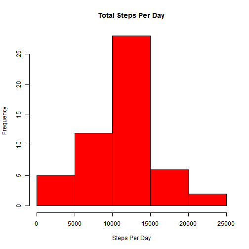
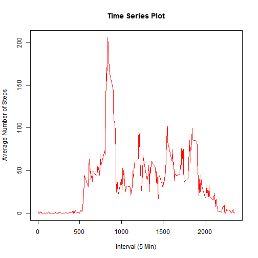
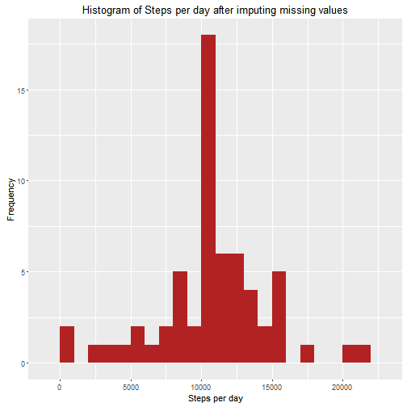
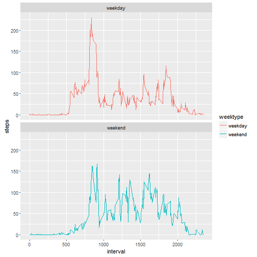

Load Necessary packages


```r
library(knitr)
library(lubridate)
library(dplyr)
library(ggplot2)
```


Loading and Reprocessing the data.
Download data if doesn't exist in current directory


```r
if(!file.exists("activity")) {
  temp <- tempfile()
  download.file("https://d396qusza40orc.cloudfront.net/repdata%2Fdata%2Factivity.zip", temp)
  file <- unzip(temp)
  unlink(temp)
}
```

1. Read and clean the data for analysis


```r
activity <- read.csv("activity.csv", header = TRUE)
```

2. Process the data for analysis
 

```r
activity$date <- ymd(activity$date)
data <- tbl_df(activity)
```

Mean and Median number of steps taken per day

1. Total number of steps taken per day


```r
Steps <- data %>%  filter(!is.na(steps)) %>%  group_by(date) %>%  summarize(steps = sum(steps)) %>%print
```

```
## Source: local data frame [53 x 2]
## 
##          date steps
##        (time) (int)
## 1  2012-10-02   126
## 2  2012-10-03 11352
## 3  2012-10-04 12116
## 4  2012-10-05 13294
## 5  2012-10-06 15420
## 6  2012-10-07 11015
## 7  2012-10-09 12811
## 8  2012-10-10  9900
## 9  2012-10-11 10304
## 10 2012-10-12 17382
## ..        ...   ...
```

2. Histogram of total number of steps taken each day


```r
hist(Steps$steps, col= "red", xlab="Steps Per Day", main= "Total Steps Per Day")
```



3. Mean of total number of steps taken per day


```r
MeanSteps <- mean(Steps$steps)
print(MeanSteps)
```

```
## [1] 10766.19
```
Answer = 10766.19

Median of total number of steps taken per day


```r
MedianSteps <- median(Steps$steps)
print(MedianSteps)
```

```
## [1] 10765
```
Answer = 10765

Average daily activity pattern

Time series plot of the average number of steps taken


```r
steps_interval <- data%>% filter(!is.na(data$steps)) %>% 
  group_by(interval) %>% summarize(steps = mean(steps))
plot(steps_interval$interval, steps_interval$steps, col="red",
     xlab="Interval (5 Min)", ylab="Average Number of Steps", 
     main="Time Series Plot", type="l")
```



The 5-minute interval that, on average, contains the maximum number of steps
First we filter by maximum value of steps and then record corresponding interval


```r
intervals <- data%>% filter(!is.na(data$steps)) %>% 
  group_by(interval) %>% summarize(steps = sum(steps)) 

(filter(intervals, steps==max(intervals$steps)))$interval
```

```
## [1] 835
```
Answer = 835th interval

Imputing missing data
1. Total number of missing values in data


```r
MissingValues <- length(which(is.na(data$steps)))
```
Number of missing values =2304

2. We will use average number of steps in the same 5 Min interval to fill out NA values


```r
data_full <- data
nas <- is.na(data_full$steps)
avg_interval <- tapply(data_full$steps, data_full$interval, mean, na.rm=TRUE, simplify=TRUE)
```

3. Creating a new data setequal to original data set but with filled missing values


```r
data_full$steps[nas] <- avg_interval[as.character(data_full$interval[nas])]
sum(is.na(data_full$steps))
```

```
## [1] 0
```

4. Histogram for total number of steps taken each day after imputing missing data


```r
steps_full <- data_full %>%
  filter(!is.na(steps)) %>%
  group_by(date) %>%
  summarize(steps = sum(steps)) %>%
  print
```

```
## Source: local data frame [61 x 2]
## 
##          date    steps
##        (time)    (dbl)
## 1  2012-10-01 10766.19
## 2  2012-10-02   126.00
## 3  2012-10-03 11352.00
## 4  2012-10-04 12116.00
## 5  2012-10-05 13294.00
## 6  2012-10-06 15420.00
## 7  2012-10-07 11015.00
## 8  2012-10-08 10766.19
## 9  2012-10-09 12811.00
## 10 2012-10-10  9900.00
## ..        ...      ...
```

```r
ggplot(steps_full, aes(x = steps)) +  geom_histogram(fill = "firebrick", binwidth = 1000) +labs(title = "Histogram of Steps per day after imputing missing values", x = "Steps per day", y = "Frequency")
```



Mean and median for the new data set


```r
mean_steps_full <- mean(steps_full$steps, na.rm = TRUE)
print(mean_steps_full)
```

```
## [1] 10766.19
```

```r
median_steps_full <- median(steps_full$steps, na.rm = TRUE)
print(median_steps_full)
```

```
## [1] 10766.19
```

Imputing missing data didn't affect the mean and median of our original data set.

Activity pattern on weekdays and weekends
1. Creating a new factor variable weektype to distinguish between weekdays and weekend data.


```r
data_full$date <- as.Date(as.character(data_full$date))
data_full <- mutate(data_full, weektype = ifelse(weekdays(data_full$date) == "Saturday" | weekdays(data_full$date) == "Sunday", "weekend", "weekday"))
data_full$weektype <- as.factor(data_full$weektype)
head(data_full)
```

```
## Source: local data frame [6 x 4]
## 
##       steps       date interval weektype
##       (dbl)     (date)    (int)   (fctr)
## 1 1.7169811 2012-10-01        0  weekday
## 2 0.3396226 2012-10-01        5  weekday
## 3 0.1320755 2012-10-01       10  weekday
## 4 0.1509434 2012-10-01       15  weekday
## 5 0.0754717 2012-10-01       20  weekday
## 6 2.0943396 2012-10-01       25  weekday
```

2. Creating the panel plot for weekdays and weekends


```r
interval_full <- data_full %>%  group_by(interval, weektype) %>%  summarise(steps = mean(steps))
p <- ggplot(interval_full, aes(x=interval, y=steps, color = weektype)) +
  geom_line() +
  facet_wrap(~weektype, ncol = 1, nrow=2)
print(p)
```



Subject seems to be more active at the start of week days compared to weekends but is more active throughtout the weekedn than weekdays.


